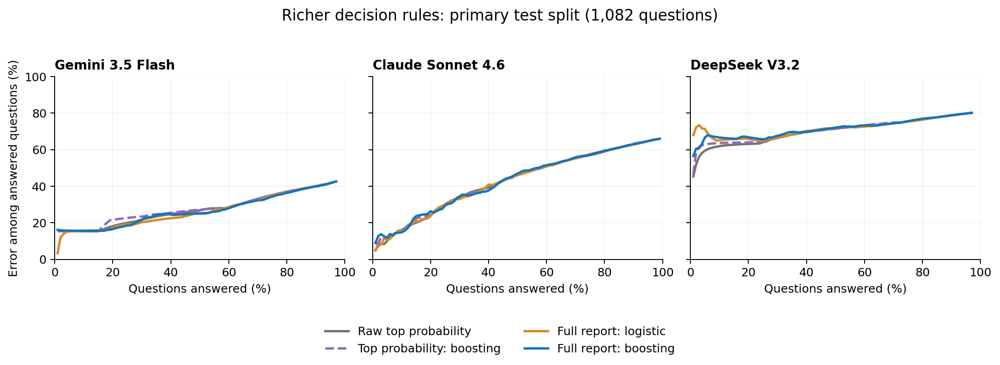

# Richer probability-report decision rules

The experiment finds a modest benefit for Gemini, but no consistent improvement
for Sonnet or DeepSeek. The added report features do not produce a broadly more
effective rule for answering under a certified error target. These results do
not justify presenting the richer rule as a strong new empirical contribution.

The main manuscript, SI Appendix, and existing figures were not changed.

## What was tested

The selected answer remains the highest-probability concrete candidate from the
original parsed response. A learned score estimates whether that candidate is
correct using seven report features: its probability, listed IDK probability,
the gap to the next concrete candidate, log candidate count, total listed
probability, normalized entropy, and the top candidate's share of concrete
probability. Predictors never use the answer key, grading results, answer text,
question identity, or other models' outputs. Correctness labels enter only when
fitting the decision score or measuring its performance.

For a report feature vector x, the fitted score is s(x) = f(x). The resulting
rule answers its original top candidate when s(x) >= t, and otherwise abstains.
This estimates the reliability of an existing answer; it does not generate a
new answer or change which candidate is selected. The fitted score is not
assumed to be calibrated.

Four methods were fixed before running the richer-rule experiment:

1. Raw top probability, without fitting.
2. Boosting using only the top probability.
3. Logistic regression using the full feature vector.
4. Boosting using the full feature vector, the primary richer rule.

The second and fourth methods use exactly the same learner settings, so their
comparison measures the value of additional report information. The logistic
method checks whether a simpler model generalizes better. There was no search
over hyperparameters after inspecting test results.

Each split contains 2,163 development, 1,081 certification, and 1,082 test
questions, with identical question membership across models. Three-fold
out-of-fold development predictions determine the threshold testing order;
learners are then fitted on all nonempty development reports. Certification and
test labels do not enter fitting or construction of that order. One primary
split and 100 additional splits were run, followed by the same experiment using
the second grader's labels. Repeated splits overlap and are not independent
replications. The benchmark had been examined before this extension, so this is
retrospective analysis, not fresh external validation.

## Error at the same answer rate

The following values are mean test error percentages across the 100 additional
splits when each rule answers the highest-ranked 20% of questions. Lower is
better. Boundary ties are randomized in expectation so arbitrary ordering of
equal scores cannot favor a method. These are descriptive comparisons at the
same answer rate, not certified operating points.

| Model | Raw top probability | Top probability: boosting | Full report: logistic | Full report: boosting |
|---|---:|---:|---:|---:|
| Gemini 3.5 Flash | 18.8% | 19.0% | 17.5% | 17.8% |
| Claude Sonnet 4.6 | 29.8% | 30.1% | 29.8% | 30.3% |
| DeepSeek V3.2 | 65.9% | 66.3% | 66.6% | 67.6% |

Gemini gains about 1.1 percentage points from the primary richer rule relative
to raw top probability, and 1.2 points relative to the matched learner using
only top probability. The simpler logistic rule does slightly better. Sonnet
shows essentially no benefit from logistic regression and slightly worse error
with boosting. DeepSeek's richer rules perform worse at this answer rate.

The figure below shows the primary test split across answer rates. The tables
above summarize the additional splits; they should not be read as the values
of the individual curves in this figure.

## Overall ranking and uncertainty

The prespecified primary information comparison is the area under the
risk-coverage curve (AURC), conditional on a nonempty report. It averages error
over all positive answered counts, with expected ordering inside score ties.
Lower is better. The table reports full-report boosting minus top-probability
boosting, multiplied by 100 for readability; negative values favor the richer
rule.

| Model | Primary difference | Adjusted paired bootstrap interval | Mean difference over 100 additional splits |
|---|---:|---:|---:|
| Gemini 3.5 Flash | -1.04 | [-2.22, 0.29] | -0.51 |
| Claude Sonnet 4.6 | 0.04 | [-0.80, 0.88] | 0.19 |
| DeepSeek V3.2 | 0.89 | [-0.92, 2.70] | 0.40 |

The primary intervals use 2,000 paired question bootstrap draws and 98.33%
intervals to adjust across the three model comparisons. They condition on the
fitted rules and reflect test-question sampling, not fitting uncertainty. All
include zero. Across additional splits, richer boosting improves AURC over its
matched top-probability comparator in 84/100 splits for Gemini, 29/100 for
Sonnet, and 31/100 for DeepSeek. Those frequencies are descriptive, not binomial
evidence from 100 independent experiments.

## Certification remains limited

For each model and fixed rule, four target errors (10%, 1/7, 20%, and 25%) use
fixed-sequence testing. Development predictions set the order before
certification. Each sequence uses a one-sided exact binomial bound with tail
0.05/4, stops at the first failure, and returns the lowest threshold among
preceding passes. If none pass, all questions are abstained on.

Conditional on development data, the fitted score and order are fixed. A
sequence can approve an unsafe threshold only by passing the first unsafe
threshold in that order, an event with probability at most 0.05/4. A union
bound over four targets gives a 95% guarantee, separately per model, fixed
rule, and split. The guarantee is not simultaneous across rules, models, or
repeated splits. It assumes independent calibration and future questions from
the same distribution, with correctness defined by the recorded grader. It
does not promise that every finite test sample's observed error is below the
target. This is an application of existing
[Learn then Test methods](https://arxiv.org/html/2110.01052v4), not a new general
risk-control theorem.

At a 25% target, the number of additional splits with a qualifying threshold is:

| Model | Raw top probability | Top probability: boosting | Full report: logistic | Full report: boosting |
|---|---:|---:|---:|---:|
| Gemini 3.5 Flash | 63/100 | 58/100 | 63/100 | 54/100 |
| Claude Sonnet 4.6 | 3/100 | 6/100 | 3/100 | 0/100 |
| DeepSeek V3.2 | 0/100 | 0/100 | 0/100 | 0/100 |

At a 20% target, Gemini qualifies in 6, 8, 1, and 5 splits in the same column
order. Sonnet qualifies once for each top-probability method and never for the
richer methods. DeepSeek never qualifies. No method qualifies at either stricter
target in these 100 splits. Failed certification is insufficient evidence for
a qualifying threshold, not proof that the target is unattainable.

On the primary split, Gemini's richer boosting rule qualifies at the 20% target
and answers 173/1,082 test questions, with 27 errors (15.6%; pointwise 95% exact
interval 10.5%–21.9%). The top-probability boosting rule also qualifies, answering
186 with 35 errors (18.8%). The richer rule answers fewer questions, so these
two operating points alone do not establish an improvement at matched coverage.

The original Bonferroni procedure was also applied to the same certification
data for every rule; those results are retained in the CSVs. The richer
experiment uses a different split allocation from the current Table S9, so
its values should not be directly substituted into that table.

## What the second grader changes

Repeating the entire procedure with the second grader gives the same pattern.
Mean error at a 20% answer rate changes from 18.9% to 17.9% for Gemini, 30.6% to
31.3% for Sonnet, and 66.2% to 68.0% for DeepSeek when moving from raw top
probability to full-report boosting. Its adjusted primary AURC intervals also
all include zero. This checks sensitivity to grader choice on the same
questions and reports; it is not independent dataset replication.

## Implications for the paper

The clearest distinction is between improving numerical probabilities and
improving answer selection. DeepSeek's mean Brier score falls from 0.226 for
raw probabilities to 0.142 when a learner uses only the top probability. This
is a substantial reduction in squared probability error, but ranking and
certified answering do not improve. Better numerical prediction therefore
does not by itself create a subset with sufficiently low answer error.

The tested extra report features add some useful information for Gemini, but
do not establish a general advantage across models. These results also do not
prove that every richer decision rule would fail: they concern two fixed
learner families, seven probability-pattern features, and this dataset.

Recommendation: keep this experiment as an exploratory analysis rather than
expanding the main paper around a new reliable-answering claim. Further work
would need a stronger source of information or independent evaluation, such as
agreement across repeated reports, retrieval evidence, or an answer verifier.
Those would change the information available to the decision rule and would
need their own cost and accuracy comparison. Simply increasing learner
complexity or trying more settings on the same benchmark would not establish
the desired contribution.

## Reproduction and verification

The fixed design is in [the analysis plan](../../analysis/rich_decision_rule_protocol.md).
The repository README gives installation and execution commands. Both output
directories retain all methods and all splits, primary per-question features
and scores, testing traces, fitted estimators, input hashes, and software
versions. Feature CSVs should be read with pandas `float_precision="round_trip"`
when reproducing tree predictions; default floating-point parsing can move a
feature across a tree boundary.

All 18 analysis tests passed, including checks that test labels cannot affect
fitting or certification, score ties are handled without label-order bias, and
fixed-sequence testing stops at its first failure. Independently reloaded
estimators reproduce saved scores to numerical precision. Calibration and
test counts, binomial tests, and stopping traces were audited for both graders.
